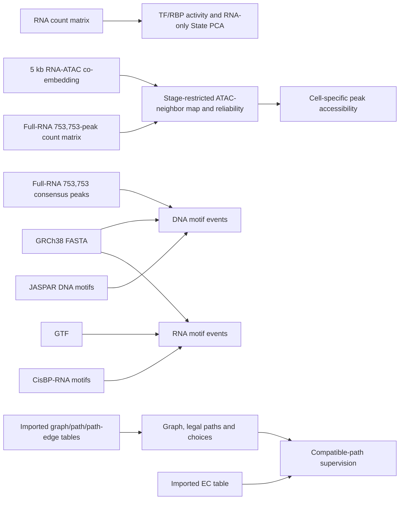
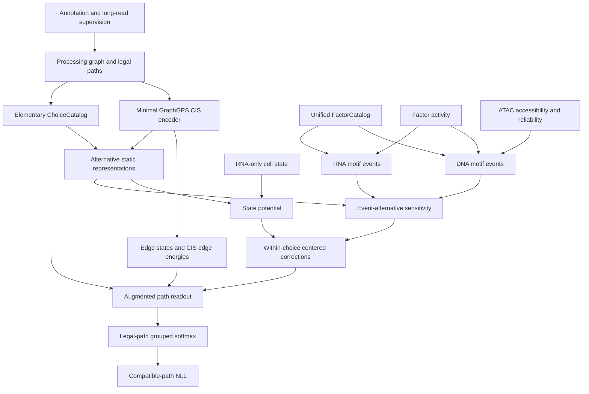

# FABRIC Architecture V1

**FABRIC: Factor-Aware Branch Regulation of Isoform Choice from DNA and RNA Motif Evidence**

> 基于 DNA/RNA motif 证据的因子感知型局部分支与异构体选择调控模型

## 文档状态

- 状态：`ARCHITECTURE_V1_FROZEN`
- 冻结日期：`2026-08-10`
- 项目路径：`/home2/xyf/project/FABRIC`
- 正式科学目标：完整 `7,198` 基因
- 当前用途：作为 F0–F4 的 V1 架构合同；顶层架构不再扩展
- 数据路径核对日期：`2026-08-10`
- 实施状态：`NOT_STARTED`
- 非授权事项：本文档不授权实现、训练、数据重建或修改现有 PRISM

FABRIC 是独立新项目，不是现有 PRISM 仓库内的兼容层或增量重构。现有 PRISM 的代码、checkpoint、artifact 和正式实验身份保持不变。FABRIC 可以读取经过独立验收的外部数据，但最终运行时不依赖 PRISM Python 模块。

## 1. 科学问题

FABRIC 第一版回答：

> 在一个细胞中，统一 factor identity 下的 DNA motif–ATAC 证据和 RNA motif–factor activity 证据，能否改变局部转录本分支 choice 中各 alternatives 的相对偏好，并改善完整合法 isoform path 的概率预测？

预测对象是细胞–基因条件下的合法完整 isoform path 分布，而不是单个剪接位点、孤立 processing edge 或总基因表达量。

### 1.1 两类独立 claim

```yaml
generalization_claim_class: transductive_supervised_cell_holdout
regulatory_interpretation_class: motif_and_cell_context_supported_association
```

- `generalization_claim_class` 描述训练、验证和测试的泛化范围。
- `regulatory_interpretation_class` 描述调控结果允许怎样解释。

第一版不宣称：

- motif hit 等同于真实蛋白占据；
- RNA 表达等同于蛋白丰度或生化活性；
- 观察到的关联具有因果效应；
- 已识别 kinetic、recruitment 或 competition 机制；
- cell holdout 等同于独立胚胎泛化。

## 2. 第一版固定决策

以下顶层方向在 V1 中固定：

1. 使用 processing graph 表达合法 RNA processing 与 splice transitions。
2. 使用合法 path catalog 约束完整转录本结构。
3. 使用 compatible-path likelihood 处理长读长不能唯一确定 isoform 的情况。
4. 第一版仅对可辨识、非嵌套、非重叠的 elementary choices 加入动态调控修正；同一套公式处理 $K\ge2$ alternatives，不为 multiway choice 增加专门模块。
5. TF、RBP 和 dual-role protein 使用统一 factor identity。
6. DNA 与 RNA 表示结合底物和证据类型，不表示互斥蛋白类别。
7. 候选结合位置仅来自固定 motif 扫描：DNA=`JASPAR 2026 CORE vertebrates`，RNA=`CisBP-RNA 2.00 human`；V1 不合并第二套 motif library。
8. DNA event 使用 factor activity、ATAC accessibility 和映射可靠性动态门控。
9. RNA event 使用当前细胞的 factor 表达或活性动态门控。
10. State、DNA 和 RNA 分支在 choice level 产生可分解的加性 logit contribution。
11. 所有动态 contribution 在同一 choice 内中心化。
12. 最终仍在合法完整 paths 上计算 grouped softmax 和 compatible-path NLL。
13. V1 默认导入经过验证的规范化 graph、path、compatible sets、split 和 full-RNA co-embedding，再直接生成所需 neighbor table；不重写完整 BAM/GTF 上游链路，也不复用旧 context artifact。
14. State、DNA 和 RNA 共享同一个由 frozen CIS states 与固定结构特征得到的 alternative 基础表示；每个分支只拥有一个小型低秩双线性 scorer，DNA/RNA 不再增加 EventEncoder。
15. Factor activity 与 accessibility 固定在非负、library-normalized `log1p` 空间，并使用 identity gate transform；DNA 先在非负空间形成 raw product，再对完整 gate 做训练基线中心化。
16. 监督可辨识性的硬门槛只依赖 graph、compatible sets 和训练监督，不引入 checkpoint/Jacobian gate。
17. ATAC peak universe 只使用由全量合格 broad-system RNA（`205,864` cells）参与的 GLUE embedding 所产生的 current peak-calling 结果；旧 `167,235`-RNA embedding 及其派生 peak 结果全部排除。

第一版不引入 ChIP、CLIP、footprint、PPI、Pol II、组蛋白修饰、AlphaGenome、DNA×RNA 高阶交互或大型多模态 Transformer。

## 3. 设计原则

### 3.1 科学对象优先

模块边界对应真实科学对象：graph、path、choice、factor、motif event、cell state 和 likelihood。不得按照兼容历史接口或通用软件模式建立额外层级。

### 3.2 最小完整闭环

先完成 toy graph 到 compatible-path NLL 的精确闭环，再接入真实数据。任何复杂模块必须证明能够回答现有简单结构不能回答的科学问题。

### 3.3 明确失败

影响科学语义的错位必须直接失败，包括 cell ID、strand、坐标、edge/path order、factor identity、peak axis、split 和 compatible-set mapping。缺失数据不得静默解释为零调控。

### 3.4 不迁移旧工程负担

V1 不建立 legacy compatibility、schema migration、factory、registry、fallback chain、通用 artifact store 或多层 release 状态机。只在外部数据导入、训练 split 和最终结果发布等真实边界保留必要 provenance。导入经过验证的数据表不等于迁移 PRISM 的代码结构、runtime 或 artifact 平台。

### 3.5 Import first，rebuild later

F0–F4 的默认路线是 `load → normalize → validate → convert`。FABRIC 使用自己的简单内部表、模型、loss 和训练代码，但允许读取 PRISM 已验证的规范化数据。完整的 `raw GTF/BAM → graph/path/supervision` 重建不属于 V1 主闭环；只有当导入数据无法满足 FABRIC 的科学合同，或模型已经证明有继续投资的价值时，才单独规划上游重建。

### 3.6 V1 封闭复杂度预算

V1 是一个封闭的最小科学模型，不是等待扩展的平台。允许的 trainable blocks 恰好只有四个：

| Block | V1 唯一允许的结构 |
|---|---|
| CIS | 一个小型 GraphGPS edge encoder 加一个 edge-energy readout |
| State | 一个作用于 RNA-only State 与 frozen alternative representation 的低秩双线性 head |
| DNA | 一个用固定 event features 与 frozen alternative representation 打分的低秩双线性 scorer |
| RNA | 一个用固定 event features 与 frozen alternative representation 打分的低秩双线性 scorer |

`Full` 只把已有 State、DNA 和 RNA corrections 相加，不拥有额外参数。除 CIS GraphGPS 外，V1 禁止再加入 MLP、attention、Transformer、alternative encoder、EventEncoder、fusion layer、adapter、mixture-of-experts、learned gate、auxiliary loss 或 DNA×RNA/factor×factor interaction；三个低秩 scorer 只含线性投影。每个模态只有一个 motif 主库、一套几何规则、一个静态 cap、一种 gate 公式和一种预先固定的 event 聚合公式。候选、missingness、ATAC mapping reliability 和 event count 都不学习；path readout 只做 incidence sum；目标函数只有 compatible-path NLL。

任何新增模态、trainable block、head、loss、交互项、第二种 encoder/backbone、可切换聚合策略、插件/registry/factory、通用 artifact 系统或 raw BAM/GTF rebuild 都属于 V2，不能以“可选配置”加入 V1。V1 冻结后只允许三类变化：保持方程不变的 bug fix；用 train/validation 审计确定本文已经声明的窗口、cap、阈值和容量数值；删除或简化结构。其他改变必须得到用户明确批准并先修改本架构合同。数据链接和 provenance 写得详细，不等于授权增加运行时组件。

## 4. 生物学对象

| 对象 | 含义 |
|---|---|
| `Cell` | 一个长读长监督单元及其可用 RNA/ATAC context |
| `Gene` | 一个 processing graph、合法 path catalog 和局部 choices 的归属单位 |
| `ProcessingNode` | `TSS`、`donor`、`acceptor` 或 `PAS` |
| `ProcessingEdge` | annotation 中允许的 processing/splice transition |
| `LegalPath` | 从起始到终止、符合 annotation/path catalog 的完整转录本路径 |
| `CompatiblePathSet` | 某个长读长 molecule/EC 无法进一步区分的一组合法 paths |
| `Choice` | 一个局部单入口、单出口的 branch–reconvergence 竞争单元 |
| `Alternative` | choice 内由合法 paths 实际采用的一条有序子路径 |
| `Factor` | 统一的调控蛋白身份 |
| `MotifEvent` | factor、motif hit、位置、底物和 alternative relation 的固定候选记录 |
| `ATACPeak` | DNA event 的局部 accessibility 支持区域 |

## 5. 数据生成过程与输入边界

FABRIC 区分以下信息：

- 长读长：提供 compatible path set 和 molecule weight；
- 基因组/annotation：提供 graph、path、坐标和 strand；
- 同细胞 RNA：提供 factor expression/activity proxy；
- 映射 ATAC：提供 peak accessibility、observed state 和 reliability；
- motif library：提供 factor-supported DNA/RNA 候选结合位置；
- metadata/RNA-only latent：提供共享 State baseline。

### 5.1 零值、缺失和低置信度

```text
value = 0, observed = 1
  表示该量被测量，但当前值为零。

value = placeholder, observed = 0
  表示没有有效观测，不能解释为生物学零值。

observed = 1, reliability < 1
  表示存在估计，但置信度较低。
```

observed mask 只表示数据可用性，不自动解决单细胞 dropout。

### 5.2 外部输入边界

FABRIC V1 默认导入现有项目已经验证的规范化 graph、path catalog、path–edge incidence、compatible sets、cell split，以及全量 RNA–ATAC co-embedding；导入后转换为 FABRIC 自己的简单表格和张量。RNA 目标细胞所需的 ATAC neighbors 必须由这一个 full-RNA co-embedding 直接生成。正式模型不得在 forward、训练或推理过程中调用 PRISM 代码，也不读取 PRISM checkpoint 或 model object。

FABRIC 自己构建 `ChoiceCatalog`、MotifEventCatalog、简单 train-only gate baselines、CIS/State/DNA/RNA model 和 compatible-path likelihood。PRISM 的 packed dataset、regulatory token tensor 和模型缓存不是 V1 输入。完整 BAM/GTF 重建属于 post-V1，不是 F1 前置条件。

导入时只验证会导致科学结果错误的不变量：

- globally unique `cell_id`；
- mutually exclusive train/val/test cells；
- gene、edge、path 和 compatible-set order 对齐；
- reference build、坐标和 strand 一致；
- factor 与 activity gene mapping 唯一或显式分组；
- ATAC peak axis 与 motif/accessibility axis 一致；
- 要求有限和非负的数据满足相应约束。

### 5.3 已核对的外部数据总览

以下链接指向当前机器上已经存在的数据。它们是 FABRIC 的**只读来源或候选迁移输入**；本次规划不复制这些大文件，也不把 PRISM 变成 FABRIC 的运行时依赖。未来实现时，FABRIC 只通过一个明确的 external-input manifest 记录最终选中的绝对路径、文件角色、reference build、坐标约定和轴身份。

状态含义：

- **主来源**：FABRIC V1 需要从该数据读取科学信息；
- **映射来源**：只用于建立 RNA–ATAC 对应关系或可靠性，不直接进入模型 State 表示；
- **候选迁移输入**：现有 PRISM 已生成的结构化结果，可在独立审计后导入；V1 不从原始 BAM/GTF 重建；
- **provenance/QC**：解释文件如何产生以及是否通过现有检查，本身不是模型特征。



关键边界是：`X_glue` 只帮助为 RNA cell 寻找合适的 ATAC donor neighborhood；它不进入 State head，也不替代真实 peak accessibility。DNA motif 必须在真实 consensus peak 序列上扫描，而不是在 5 kb GLUE bin 上扫描。

### 5.4 RNA 矩阵与细胞 metadata

| 文件 | 文件具体是什么 | FABRIC 中的用途 |
|---|---|---|
| [Illumina RNA count matrix](/home1/xyf/project/Multi_Omic/data/gene_matrix_Illumina/gene_matrix_Illumina.h5ad) | `217,933 cells × 32,351 genes` 的稀疏整数 count H5AD；gene 轴是 Ensembl gene ID；`obs` 含 embryo、stage、developmental system、cell type 和 QC 字段。`in_system=1` 的 `205,864` 个细胞构成当前 broad-system GLUE RNA cohort。 | **主来源**。从同一 RNA cell 读取 TF/RBP gene expression，构造 factor activity；同时在 train split 内拟合 RNA-only PCA 作为共享 State baseline。原始 counts 不直接当作已经归一化的 activity。 |
| [Aligned RNA cell metadata](/home1/xyf/project/Multi_Omic/data/gene_matrix_Illumina/cell_meta_final.aligned.tsv) | 与上面 H5AD 的 cell 顺序对齐的文本 metadata；首列为原始 RNA `cell_id`。 | 人工检查和导入审计；模型以 H5AD `obs` 为主，不维护第二套可分叉标签。 |
| [RNA gene IDs](/home1/xyf/project/Multi_Omic/data/gene_matrix_Illumina/genes.tsv) 与 [RNA barcodes](/home1/xyf/project/Multi_Omic/data/gene_matrix_Illumina/barcodes.tsv) | Matrix Market 版本对应的 gene 与 cell 轴文本。 | 仅用于核对 H5AD 与原始矩阵轴，不作为额外训练输入。 |
| [5 kb GLUE input provenance](/home2/xyf/project/PRISM/outputs/cs15_atac_merged_peakglue_cellranger_2024A_v4/sensitivity/global_5kb_glue_broad_system_no_knn_v1/inputs/prepare_glue_5kb_inputs_provenance.json) | 记录 co-embedding 的 RNA/ATAC 来源、RNA cohort 筛选和输入维度：RNA 使用 broad-system cohort、`8,000` HVGs，ATAC 使用约 `80,000` 个 5 kb bins。 | **provenance**。用于证明 co-embedding membership 和特征构造，不作为 FABRIC 模型输入。 |

RNA 原始 H5AD 的 ID 类似 `Emb06_head_...`，joint GLUE 文件中的同一 RNA cell 使用 `RNA__Emb06_head_...`。FABRIC 导入时必须生成并持久化一对一 ID map；只允许显式增加或移除 `RNA__` namespace，不允许模糊字符串匹配。RNA cell 和 factor gene 都存在但 count 为零时，是 `observed=1, value=0`；cell 或 factor gene 不在来源轴上时才是 `observed=0`。

### 5.5 Full-RNA current ATAC/GLUE 与两条允许轴

#### 5.5.1 核心文件

| 文件 | 文件具体是什么 | FABRIC 中的用途 |
|---|---|---|
| [Full-RNA joint 5 kb GLUE co-embedding](/home2/xyf/project/PRISM/outputs/cs15_atac_merged_peakglue_cellranger_2024A_v4/sensitivity/global_5kb_glue_broad_system_no_knn_v1/glue/combined_glue_5kb_embedding.h5ad) | `438,338 cells × 0 features` 的坐标容器，包括全部合格 broad-system `205,864 RNA + 232,474 ATAC` cells；`obsm['X_glue']` 为 50 维共同空间，`obsm['X_umap']` 为 2 维展示坐标。它不保存表达或 peak count 矩阵。 | **唯一映射来源**。对目标 RNA cell 在该 `X_glue` 中寻找经过 stage/donor eligibility 约束的 ATAC neighbors，形成 accessibility 聚合值和 mapping reliability。`X_umap` 只用于可视化。 |
| [GLUE run provenance](/home2/xyf/project/PRISM/outputs/cs15_atac_merged_peakglue_cellranger_2024A_v4/sensitivity/global_5kb_glue_broad_system_no_knn_v1/glue/run_glue_5kb_provenance.json) | 记录 joint embedding 的输入 shape、训练参数以及 RNA、ATAC、combined embedding 输出路径。 | **provenance/QC**，用于重现或审计 co-embedding 身份。 |
| [Full-RNA consensus peak BED](/home2/xyf/project/PRISM/outputs/cs15_atac_merged_peakglue_cellranger_2024A_v4/sensitivity/global_5kb_glue_broad_system_no_knn_v1/peak_rebuild_previous_v4_params_v1/peak_calling/consensus_peaks.bed) | `753,753` 行、GRCh38、BED `0-based half-open` 的 consensus peak universe；peak clusters 来自上面的 `205,864`-RNA full co-embedding，随后进行 pseudoreplicate peak calling 和 consensus merge。 | **唯一 DNA peak universe**。先按 choice 几何窗口取局部 peaks，再扫描 DNA motif；不会把全部 peaks 送入单个 gene。 |
| [Full-RNA cell-by-peak count matrix](/home2/xyf/project/PRISM/outputs/cs15_atac_merged_peakglue_cellranger_2024A_v4/sensitivity/global_5kb_glue_broad_system_no_knn_v1/peak_rebuild_previous_v4_params_v1/peak_calling/peak_matrix_with_developmental_system.h5ad) | `232,474 ATAC cells × 753,753 peaks` 的 CSR fragment-count H5AD，沿用同一 full-RNA peak BED，并附 `developmental_system` metadata。 | **唯一 accessibility 主来源**。只读取 MotifEventCatalog 命中的 peak columns，再按 full-RNA co-embedding 中的 ATAC neighbor weights 聚合；禁止整体 densify。 |
| [Full-RNA peak-calling provenance](/home2/xyf/project/PRISM/outputs/cs15_atac_merged_peakglue_cellranger_2024A_v4/sensitivity/global_5kb_glue_broad_system_no_knn_v1/peak_rebuild_previous_v4_params_v1/peak_calling/provenance.json)、[peak validation](/home2/xyf/project/PRISM/outputs/cs15_atac_merged_peakglue_cellranger_2024A_v4/sensitivity/global_5kb_glue_broad_system_no_knn_v1/peak_rebuild_previous_v4_params_v1/peak_calling/validation_summary.json)、[raw matrix provenance](/home2/xyf/project/PRISM/outputs/cs15_atac_merged_peakglue_cellranger_2024A_v4/sensitivity/global_5kb_glue_broad_system_no_knn_v1/peak_rebuild_previous_v4_params_v1/peak_calling/peak_matrix.provenance.json)、[raw matrix validation](/home2/xyf/project/PRISM/outputs/cs15_atac_merged_peakglue_cellranger_2024A_v4/sensitivity/global_5kb_glue_broad_system_no_knn_v1/peak_rebuild_previous_v4_params_v1/peak_calling/peak_matrix.validation.json) 与 [annotated matrix audit](/home2/xyf/project/PRISM/outputs/cs15_atac_merged_peakglue_cellranger_2024A_v4/sensitivity/global_5kb_glue_broad_system_no_knn_v1/peak_rebuild_previous_v4_params_v1/peak_calling/peak_matrix_with_developmental_system.audit.json) | 记录 `205,864` RNA reference cells、`232,474` ATAC cells、`18` clusters、`753,753` consensus peaks；现有状态为 `PASS`。 | **provenance/QC**。证明 peak 和 matrix 属于 full-RNA generation；不替代 FABRIC 的 cell/peak 轴检查。 |

#### 5.5.2 V1 只保留两条 ATAC 轴

| 轴 | 数量 | 含义 | 允许用途 |
|---|---:|---|---|
| 5 kb GLUE bins | `80,377`（当前输入矩阵实际列数） | 为建立 RNA–ATAC 共同空间而使用的粗粒度 ATAC features | neighbor mapping；不做最终 motif event |
| Full-RNA consensus peaks | `753,753` | 由 `205,864`-RNA co-embedding 引导 cluster 后 call 出的 current peak universe | FABRIC DNA motif 候选和 accessibility 来源 |

旧 `167,235`-RNA embedding 派生的 `756,188`-peak atlas、`150,000` selected-peak atlas、`61,002` runtime subset 及其 context artifacts 均为历史遗留：FABRIC V1 不读取、不比较、不做 fallback，也不把它们列为候选路线。这里的 `167,235` 指旧 embedding 的 RNA 构建规模；FABRIC 最终有监督目标 cohort 仍可因长读长覆盖而是 `167,235` cells，这不改变 peak universe 必须来自 `205,864`-RNA full embedding 的规定。

FABRIC V1 的数据路线固定为：从 `753,753` 个 full-RNA peaks 中按 choice 的固定几何范围取局部候选，在这些候选序列上扫描 motif，随后只读取命中事件对应的 accessibility columns。最终 MotifEventCatalog 拥有自己的有序 `peak_id` 轴，并要求 BED、motif hit 和 accessibility 三者逐项一致。

GLUE 的 50 维坐标不作为 State feature。它只产生 ATAC neighborhood、距离、有效邻居数等映射信息；这些量进一步形成 `observed_atac` 和 reliability。若某个 RNA cell 没有合格 ATAC neighborhood，DNA branch 使用 `observed_atac=0` 而不是 accessibility `0`。

### 5.6 Reference、annotation 与坐标来源

| 文件 | 文件具体是什么 | FABRIC 中的用途 |
|---|---|---|
| [GRCh38 genome FASTA](/home2/xyf/project/PRISM/data/reference/genome.fa) 与 [FASTA index](/home2/xyf/project/PRISM/data/reference/genome.fa.fai) | 当前 graph/sequence 工作流使用的 GRCh38 基因组序列及 `.fai`；本地链接指向共享 reference 数据。 | **主来源**。提取 splice-site、pre-mRNA、peak 序列并执行 DNA/RNA motif scan。 |
| [Long-read transcript-model GTF](/home2/xyf/project/PRISM/data/new_bam/gtf/20260110_OUT.transcript_models_reid.sorted.gtf) | IsoQuant 生成并重新编号、排序的长读长 transcript model annotation。 | **graph/path 主来源**。定义 transcript、exon、strand、TSS/PAS 与合法 path；不是 RNA count matrix 的 gene annotation。 |
| [10x GRCh38-2020-A genes GTF](/home1/xyf/data/gtf/grch38_10x/refdata-gex-GRCh38-2020-A/genes/genes.gtf) | RNA count reference 使用的 GENCODE v32/Ensembl 98 gene annotation。 | 解释 RNA matrix 的 Ensembl gene 轴，并把 TF/RBP activity gene 映射到 graph gene；不直接定义 FABRIC transcript paths。 |
| [10x reference metadata](/home1/xyf/data/gtf/grch38_10x/refdata-gex-GRCh38-2020-A/reference.json) | 记录 `GRCh38`、Cell Ranger reference `2020-A`、输入 FASTA 和 filtered GTF 身份。 | **provenance/QC**，用于说明 RNA gene matrix 的 reference 来源。 |
| [GENCODE v44 GFF3 used by 5 kb GLUE](/home2/xyf/project/PRISM/archive/pre_cellranger_uniform_rebuild_20260730/outputs/cs15_atac_merged_peakglue_v3/references/gencode.v44.primary_assembly.annotation.gff3.gz) | 构建当前 5 kb GLUE guidance graph 时使用的 gene annotation。 | 仅解释 GLUE provenance；不替换长读长 transcript-model GTF。 |
| [ENCODE blacklist used during ATAC peak calling](/home2/xyf/project/PRISM/archive/pre_cellranger_uniform_rebuild_20260730/outputs/cs15_atac_merged_peakglue_v3/references/ENCFF356LFX.bed) 与 [full-RNA peak-calling provenance](/home2/xyf/project/PRISM/outputs/cs15_atac_merged_peakglue_cellranger_2024A_v4/sensitivity/global_5kb_glue_broad_system_no_knn_v1/peak_rebuild_previous_v4_params_v1/peak_calling/provenance.json) | current `753,753`-peak universe 使用的 blacklist 与 MACS3/pseudoreplicate 参数记录。 | 解释 full-RNA peak universe 如何产生；不是模型特征。 |

磁盘上的 GTF 坐标按 GTF 规范为 `1-based closed`，BED 与 FABRIC 内部区间统一为 `0-based half-open`。坐标只在 annotation import 边界转换一次。三个 annotation 版本承担不同角色，必须通过稳定 Ensembl gene ID 连接，不能假设 transcript ID 或 exon 边界完全相同。

### 5.7 DNA/RNA motif reference

| 文件 | 文件具体是什么 | FABRIC 中的用途 |
|---|---|---|
| [JASPAR 2026 CORE vertebrate motifs](/home2/xyf/project/PRISM/data/motifs/jaspar2026_core_vertebrates_nonredundant.meme) | MEME 格式的 `1,019` 个 non-redundant DNA PFMs。 | V1 DNA motif library 的首选主来源。 |
| [JASPAR motif index](/home2/xyf/project/PRISM/data/motifs/jaspar2026_core_vertebrates_motif_index.tsv) 与 [source manifest](/home2/xyf/project/PRISM/data/motifs/tf_motif_manifest.json) | motif ID、TF name、width、source URL 和下载/校验记录。 | 构建 DNA motif → unified factor identity 映射并保留来源。 |
| [CisBP-RNA 2.00 human RBP metadata](/home2/xyf/project/PRISM/data/motifs/raw/cisbp_rna_2.00_human/RBP_Information.txt)、[PWM directory](/home2/xyf/project/PRISM/data/motifs/raw/cisbp_rna_2.00_human/pwms_all_motifs) 与 [human motif-gene map](/home2/xyf/project/PRISM/data/motifs/cisbp_rna_human_motif_gene_map.tsv) | Human RBP metadata、逐 motif PWM 文件，以及整理后的 `492 motifs / 267 Ensembl gene IDs` 映射。 | V1 RNA motif library 的首选主来源；用 Ensembl gene ID 与当前细胞 RNA activity 相连。 |
| [ATtRACT database](/home2/xyf/project/PRISM/data/motifs/raw/attract_2016/ATtRACT_db.txt)、[ATtRACT PWM](/home2/xyf/project/PRISM/data/motifs/raw/attract_2016/pwm.txt) 与 [human motif-gene map](/home2/xyf/project/PRISM/data/motifs/attract_human_motif_gene_map.tsv) | 可用的第二套 RNA motif 来源。 | **Post-V1 reference only**。V1 不读取、不合并，也不为它实现去重或冲突处理。 |

Motif 文件提供的是固定结合能力先验，不等于真实细胞中的占据。细胞动态性来自 RNA factor activity；DNA event 还需要 ATAC accessibility 和 mapping reliability。若一个 motif 无法唯一归到单个蛋白，FactorCatalog 使用 factor group，而不是复制成多个看似独立的 factor event。

### 5.8 长读长监督、graph/path 与 split

V1 默认在审计通过后导入当前结构化 graph/path/EC 结果。BAM、BAI 和 GTF 保留为原始来源与问题追溯入口，但不要求第一版重新扫描约 195 GB BAM。为了保持新项目独立，导入的是数据表，不是 PRISM Python 对象、packed tensor 或 checkpoint。

| 文件 | 文件具体是什么 | FABRIC 中的用途 |
|---|---|---|
| [Merged annotated long-read BAM](/home2/xyf/project/PRISM/data/new_bam/20260125_merged.filtered.annotated_final_withTX.bam) 与 [BAI](/home2/xyf/project/PRISM/data/new_bam/20260125_merged.filtered.annotated_final_withTX.bam.bai) | 约 `195 GB` 的合并、过滤、带 transcript assignment tags 的长读长 alignment 及索引。 | **原始监督来源/追溯入口**。用于审计 molecule assignment 或未来重建；V1 常规实现优先导入下面的 EC 表，不重复扫描 BAM。 |
| [Current graph pointer](/home2/xyf/project/PRISM/data/i6_multi7198_terminal_v2/artifacts/graph/CURRENT.json) 与 [graph contract](/home2/xyf/project/PRISM/data/i6_multi7198_terminal_v2/artifacts/graph/generations/d51be2344bb0e5acde0e5cf9b8e5aded7b38c2666a639c836051f7b48f714bc4/outputs/graph/graph_artifact_contract.json) | 指向当前 graph generation；合同声明 GRCh38、`0-based half-open`、转录方向 `5'→3'` 和 path admission policy。 | **候选迁移输入**的身份入口。FABRIC 导入器先读 pointer，再冻结实际 generation 路径。 |
| [Node table](/home2/xyf/project/PRISM/data/i6_multi7198_terminal_v2/artifacts/graph/generations/d51be2344bb0e5acde0e5cf9b8e5aded7b38c2666a639c836051f7b48f714bc4/outputs/graph/node_table.parquet)、[edge table](/home2/xyf/project/PRISM/data/i6_multi7198_terminal_v2/artifacts/graph/generations/d51be2344bb0e5acde0e5cf9b8e5aded7b38c2666a639c836051f7b48f714bc4/outputs/graph/edge_table.parquet)、[path table](/home2/xyf/project/PRISM/data/i6_multi7198_terminal_v2/artifacts/graph/generations/d51be2344bb0e5acde0e5cf9b8e5aded7b38c2666a639c836051f7b48f714bc4/outputs/graph/path_table.parquet) 与 [path-edge table](/home2/xyf/project/PRISM/data/i6_multi7198_terminal_v2/artifacts/graph/generations/d51be2344bb0e5acde0e5cf9b8e5aded7b38c2666a639c836051f7b48f714bc4/outputs/graph/path_edge_table.parquet) | 当前 generation 分别含 `295,904` nodes、`427,160` edges、`72,749` legal paths 和 `999,278` ordered path-edge rows。 | 构建 FABRIC graph、GraphGPS 输入、legal path catalog；`ChoiceCatalog` 由 FABRIC 从这些表重新提取，不沿用旧 choice 逻辑。 |
| [Compatibility equivalence classes](/home2/xyf/project/PRISM/data/i6_multi7198_terminal_v2/supervision/.artifact/generations/c6c36a3a3144179de935816e3b531df0e3619fcd66d94292d360d5184abf3ab7/outputs/supervision/compatibility_equivalence_classes.parquet) | `59,545,590` 个 cell–gene compatible-path EC rows；含 ordered compatible path IDs、molecule count 和 QC。 | **候选监督主表**。直接提供 compatible set 与 molecule weight，供 compatible-path NLL 使用。 |
| [Molecule-path compatibility](/home2/xyf/project/PRISM/data/i6_multi7198_terminal_v2/supervision/.artifact/generations/c6c36a3a3144179de935816e3b531df0e3619fcd66d94292d360d5184abf3ab7/outputs/supervision/molecule_path_compatibility.parquet) 与 [supervision manifest](/home2/xyf/project/PRISM/data/i6_multi7198_terminal_v2/supervision/.artifact/generations/c6c36a3a3144179de935816e3b531df0e3619fcd66d94292d360d5184abf3ab7/outputs/supervision/supervision_manifest.json) | 分子级 `molecule→path` 兼容关系及 assignment/QC policy；体积远大于聚合 EC 表。 | 审计 EC、定位 mapping 问题或重聚合时读取；常规训练不逐分子扫描。 |
| [Current cell split rows](/home2/xyf/project/PRISM/data/final_multimodal_simple_12run_v1/D2/split_manifest/generations/87e623496acaa2799f4fdcbe6befbc965b70ca7324eada288d11d4c7965195d9/outputs/split_rows.parquet) 与 [split manifest](/home2/xyf/project/PRISM/data/final_multimodal_simple_12run_v1/D2/split_manifest/generations/87e623496acaa2799f4fdcbe6befbc965b70ca7324eada288d11d4c7965195d9/outputs/split_manifest.json) | `167,235` RNA cells 的 embryo-stratified stable cell holdout：`133,799 train / 16,718 val / 16,718 test`。 | 与 FABRIC 的 `transductive_supervised_cell_holdout` claim 相符，是首选复用候选；最终是否冻结复用仍需在 F1 审计 cell coverage。 |

现有 EC 表中的 `split` 列来自更早的生成身份，不能直接作为 FABRIC split authority。若复用当前 cell split，必须仅按 globally unique `cell_id` 与上面的 D2 split rows 重新连接，并验证同一 cell 的所有 genes、molecules 和 EC rows 进入同一 split。

### 5.9 外部数据进入 FABRIC 时的最小合同

未来的 `data/external_inputs.yaml` 只记录选中的来源和科学语义，不复制大文件。对带 `CURRENT.json` 的来源，manifest 必须同时记录 discovery pointer 和当时解析出的不可变 generation 路径；正式 run 只能读取后者，不能随可变 `CURRENT` 漂移。至少包含：

```yaml
reference_build: GRCh38
coordinate_system_internal: 0-based-half-open
rna_counts: <absolute h5ad path>
full_rna_glue_embedding: <205864-RNA co-embedding h5ad path>
full_rna_consensus_peak_bed: <753753-peak bed path>
full_rna_atac_peak_counts: <232474-by-753753 h5ad path>
graph_generation: <resolved generation path>
compatibility_ec: <absolute parquet path>
cell_split: <absolute parquet path>
fabric_context_neighbors: <FABRIC-derived table path>
dna_motif_library: <absolute meme path>
rna_motif_library: <absolute CisBP path>
```

导入后必须一次性验证：

1. RNA、GLUE、ATAC、long-read 和 split 的 cell ID 可通过显式 map 对齐；
2. FASTA contigs、GTF、peak BED 和 graph 均为同一 GRCh38 坐标空间；
3. full peak BED order、ATAC H5AD `var_names` 和选出的 event peak IDs 完全一致；
4. graph 的 gene/path/edge order 与 EC 中 path IDs 完全一致；
5. factor activity gene ID 与 motif→factor mapping 唯一或显式归入 factor group；
6. GLUE latent 只参与 ATAC mapping，不进入 State feature；
7. split 只由独立 split table 决定，不信任旧数据表内嵌的 split 字段；
8. 缺失 RNA/ATAC observation 产生 observed mask，不填成生物学零值；
9. graph/path/motif catalog 可以 split-neutral，但 supervision eligibility、alternative support、molecule-mass threshold、gate baselines 和所有中心化统计只能由 train split 计算；
10. `X_glue` neighbor mapping 可以在当前 transductive claim 下覆盖目标 cells，但不得读取 validation/test isoform labels、compatible sets 或预测误差来选择 donor、peak 或 mapping 参数。
11. co-embedding provenance 必须证明 RNA 构建规模为 `205,864`，peak BED 和 accessibility matrix 必须逐项属于同一 `753,753`-peak full-RNA generation；任何 `167,235`-RNA embedding 派生结果直接拒绝。

## 6. 总体架构



## 7. Processing graph、CIS 与合法路径

### 7.1 Processing graph

节点类型固定为 `TSS`、`donor`、`acceptor` 和 `PAS`。Edge 表示 annotation 中允许的 transition。所有 first/last、upstream/downstream 和 signed distance 均按转录方向定义，不按染色体数值升序替代。

### 7.2 Minimal GraphGPS CIS encoder

FABRIC 自行实现一个小型 GraphGPS-style CIS encoder，不导入现有 PRISM model：

- processing edges 作为主要可学习状态；
- 局部消息传递表达相邻 transition 与共享 site；
- gene 内全局 attention 表达长程图上下文；
- 输出 edge state $q_e$ 和 CIS edge energy $\psi_e^{cis}$。

V1 只实现这一种浅层 GraphGPS，并在 F3 前冻结一组容量数值；不做 encoder search、不提供第二种 backbone，也不建立可插拔 encoder registry。

### 7.3 合法 paths

Path catalog 只包含允许的完整转录本结构。定义 path–edge incidence：

$$
M^{edge}_{p,e}=\mathbb{1}[e\in p].
$$

CIS path logit 为：

$$
L^{cis}_{i,p}=\sum_e M^{edge}_{p,e}\psi^{cis}_{i,e}.
$$

### 7.4 CIS admission gate

动态分支只有在 CIS parent 足够可信时才允许进入正式调控比较。这里不建立新的 gate 框架或状态机，只在 F3 开始前检查一张固定结果表。

`B0` 固定为同一 train split、同一 legal path catalog 上的 train-only path-frequency baseline：每个 informative EC 的 molecule mass 在其 compatible paths 间等分，按 gene 聚合后对每条 path 加 Laplace pseudocount `1.0`。B0 不读取 validation/test labels。

CIS admission 只有两个强制条件：

1. **Likelihood exactness**：在 toy 枚举和冻结的真实 fixture 上，给定同一组 path logits 时，FABRIC compatible-path NLL 与手工 brute force 完全一致，并在浮点容差内复现独立参考实现的 row-level NLL。
2. **B0 improvement**：FABRIC CIS 在预先冻结的 validation scope、row weights 和 compatible-path NLL 上，相对 B0 达到预先规定的最小收益。

若恰好存在 input、split、path catalog、eligible rows 和 metric 全部一致的 PRISM C1，可额外报告 matched non-inferiority；否则标记 `NOT_COMPARABLE`。它只是外部参考，不是 V1 admission 条件，也不触发额外重跑或 identity workflow。任何强制条件失败都阻止将后续 DNA/RNA 增益解释为可靠的调控增量。

## 8. Elementary ChoiceCatalog

### 8.1 Elementary choice

V1 只接收满足以下条件的局部 bubble：

1. 一个确定 entry 和一个确定 exit；
2. entry 与 exit 之间至少两条不同合法子路径；
3. 每条参与 path 唯一映射到一个 alternative；
4. alternative 内部不含待继续分解的分叉；
5. alternatives 除边界外不共享内部节点；
6. choice 不重叠、不嵌套；
7. 所有选择和 tie-break 规则确定且可复现。

同一套 alternative-centered 张量公式处理所有通过条件的 $K\ge2$ choices，不按二元或多元建立不同模型。复杂区域标记为 `unsupported_complex`；这些区域仍由 GraphGPS CIS edge energy 参与完整 path 预测，但不接收 State/DNA/RNA choice correction，也不产生调控归因。

### 8.2 Choice incidence

每个 `(choice_id, alternative_id)` 对应一列：

$$
M^{choice}_{p,c,a}=\mathbb{1}[p\text{ chooses }a\text{ in }c].
$$

同一 path 在同一 choice 内最多选择一个 alternative。

### 8.3 两层可辨识性

结构可辨识性检查 centered choice incidence 是否达到 $K-1$ 维。监督可辨识性的硬门槛不依赖任何已训练 checkpoint，而由 train compatible sets 是否能够区分全部 $K-1$ 个 alternative contrasts 决定。

令 $H_c\in\mathbb R^{K\times(K-1)}$ 为一个固定的零和 contrast basis，满足 $H_c^\top\mathbf 1=0$ 且 $\operatorname{rank}(H_c)=K-1$。对正 molecule weight 的训练 EC $k$，定义：

$$
d_{k,a}
=\frac{1}{|C_k|}\sum_{p\in C_k}M^{choice}_{p,c,a}
-\frac{1}{|Y_g|}\sum_{p\in Y_g}M^{choice}_{p,c,a},
$$

$$
D_{k,:}=d_k H_c.
$$

$D$ 等价于 uniform path logits 下、只针对 choice contrasts 的 compatible-log-likelihood 局部设计矩阵，因此只依赖 path incidence 和 compatible sets，不受 frozen CIS 恰好把某条 path 压到低概率的影响。监督硬门槛要求：


```text
rank(centered_path_choice_incidence) = K - 1
rank(D_train) = K - 1
informative_molecule_mass >= frozen_threshold
each_alternative_informative_support >= frozen_threshold
```

其中 choice-informative EC 是 $D_{k,:}\neq 0$ 的行，`informative_molecule_mass` 是这些 EC 的 molecule weight 之和。每个 alternative 的支持度从正权重、对该 alternative contrast 有非零信息的 EC 计算。rank tolerance、总质量和 alternative 支持阈值只用 train split 冻结。

V1 不计算 checkpoint-dependent Jacobian rank、singular-value 或 gradient-variation 指标；硬门槛已经由上面的确定性数据矩阵完整定义。

### 8.4 覆盖率

正式报告：

- gene coverage；
- legal path coverage；
- informative EC coverage；
- molecule-weighted supervision coverage；
- supervision-identifiable choice coverage。

## 9. FactorCatalog 与 MotifEventCatalog

### 9.1 统一 factor identity

FactorCatalog 至少包含：

```text
factor_id
factor_name
activity_gene_id
factor_group_id
has_dna_motif
has_rna_motif
canonical_label
dna_motif_ids
rna_motif_ids
```

`canonical_label` 仅用于报告。共享 motif 无法唯一归因时，使用 `factor_group_id` 或排除，不把同一 motif 随意复制给多个高度共线的家族成员。

### 9.2 DNA motif events

1. 从固定 ATAC peak universe 中选择与 choice 有确定几何关系的 peaks；
2. 候选 peak 只按位置、距离和静态 peak support 选择；
3. 在 peak 序列中扫描 DNA motif；
4. 保留 factor、motif、peak、坐标、orientation、anchor、距离和 alternative relation。

DNA event 的候选身份不依赖当前细胞 activity、accessibility 或 isoform label。

### 9.3 RNA motif events

在转录方向正确的 pre-mRNA 序列中扫描 RNA motif，限定于 choice entry/exit、alternative-specific exon/intron 和固定局部窗口。保留 factor、motif、转录方向坐标、anchor、signed distance、region type 和 alternative relation。

### 9.4 固定候选截断

候选集合对所有细胞一致。截断只使用静态 motif score、distance、region bin 和 peak support，不使用 cell-specific dynamic top-K。

候选上限在真实数据审计后冻结，至少报告：

```text
events_per_choice
cap_saturation_rate
boundary_rank_motif_score
supervision_coverage
GPU_memory
batch_throughput
```

## 10. Cell State baseline

State branch 吸收共享细胞状态和主要测序深度差异，不归因到具体 factor。V1 输入固定为 train-fitted-and-frozen RNA-only PCA 加一个 `log1p(RNA library size)`；不再并列加入 stage、developmental system、cell type、batch category 或其他 metadata embedding。这样共享发育状态由同一份 RNA 表示承担，而不是重复编码多套高度相关标签。

V1 不使用 RNA–ATAC GLUE latent，避免 State 与 DNA branch 重复读取 ATAC 映射来源。

所有 State 和 gate 的训练基线使用同一个 cell–gene 权重：

$$
w_{i,g}=\sum_{k\in\mathcal K^{train,informative}_{i,g}}n_k,
$$

即同一 cell–gene 下所有有效 informative EC 的 molecule mass 之和。V1 loss 不另加 row reweighting，因此该 mass 就是实际训练权重；$w_{i,g}$ 每个 cell–gene 只计算一次，不能因为一个 cell–gene 被拆成多行 EC 或多个 motif events 而重复加权。

State 输入由 train-fitted-and-frozen RNA-only PCA 和标准化后的 `log1p(RNA library size)` 直接拼接。令 $v^z_i$ 表示 State observation 有效，则：

$$
\mu^{train}_{z,g}
=\frac{\sum_{i\in train}w_{i,g}v^z_i z_i}
{\sum_{i\in train}w_{i,g}v^z_i},
$$

$$
\widetilde z_{i,g}=v^z_i\left(z_i-\mu^{train}_{z,g}\right).
$$

分母为零时该 gene 的 State gate 不可用，不能用零均值 fallback。State correction 使用唯一的低秩 alternative-conditioned head，并在同一 choice 内中心化。

## 11. 动态门控

V1 先把 RNA factor expression 和 ATAC peak counts 各自构造成非负、library-normalized 的 `log1p` 值；RNA–ATAC 聚合在同一个已声明空间完成。随后固定使用恒等 gate 变换：

$$
\phi_F:\mathbb R_{\ge 0}\rightarrow\mathbb R_{\ge 0},\qquad
\phi_A:\mathbb R_{\ge 0}\rightarrow\mathbb R_{\ge 0},
$$

$$
\phi_F(t)=t,\qquad \phi_A(t)=t.
$$

因此两者非负、单调并保持零值。V1 不提供 transform 选择、不做 clipping、不学习 gate，也不允许在 DNA 乘积之前分别减均值或做产生负值的 z-score。输入归一化方法及其 train-fitted 参数一经确定即冻结到 validation/test，已在 `log1p` 空间的数据不得再次 `log1p`。

### 11.1 RNA gate

对 gene $g$、factor $f$：

$$
b^{RNA}_{i,f}=\phi_F(x_{i,f}),
$$

$$
\mu^{RNA}_{g,f}
=\frac{\sum_{i\in train}w_{i,g}v^F_{i,f}b^{RNA}_{i,f}}
{\sum_{i\in train}w_{i,g}v^F_{i,f}},
$$

$$
\widetilde g^{RNA}_{i,g,f}
=v^F_{i,f}\left(b^{RNA}_{i,f}-\mu^{RNA}_{g,f}\right).
$$

$\mu^{RNA}_{g,f}$ 仅由训练 split 中有效观测计算。

### 11.2 DNA gate

对 factor $f$、peak $p$：

$$
b^{DNA}_{i,f,p}=\phi_F(x_{i,f})\phi_A(A_{i,p}),
$$

$$
\mu^{DNA}_{g,f,p}
=\frac{
\sum_{i\in train}w_{i,g}v^F_{i,f}v^A_{i,p}r_{i,p}
b^{DNA}_{i,f,p}
}{
\sum_{i\in train}w_{i,g}v^F_{i,f}v^A_{i,p}r_{i,p}
},
$$

$$
\widetilde g^{DNA}_{i,g,f,p}
=v^F_{i,f}v^A_{i,p}r_{i,p}
\left(b^{DNA}_{i,f,p}-\mu^{DNA}_{g,f,p}\right).
$$

非负 raw product 构造完成后才减去其加权训练均值。这样“低 factor activity × 低 accessibility”不会因为两个负 z-score 相乘而变成高 gate。可靠性 $r$ 是置信度，只将 contribution 收缩向零；低可靠性本身不解释为反方向调控。

任何均值公式的分母为零时，对应 gate 直接标记为无训练覆盖并退出 eligibility；不得静默令 $\mu=0$。上述定义保证在当前 molecule-weighted estimand 下，训练集中的 $\widetilde g^{RNA}$ 和 $\widetilde g^{DNA}$ 加权均值为零。

### 11.3 Gate eligibility

每个 gate key 只记录决定 eligibility 所需的量：

```text
valid_molecule_mass
weighted_variance
DNA_reliability_mass
```

RNA 不记录 `DNA_reliability_mass`。无训练覆盖或动态变化不足的 gate 标记为 `insufficient_dynamic_variation`，相关 events 不参与训练；V1 不建立可扩展 GateStats 指标 registry。

## 12. Alternative 与 Event scorer

### 12.1 Alternative representation

对 alternative $a$，定义不再经过共享 trainable MLP 的基础表示：

$$
h^{base}_{c,a}=\operatorname{concat}\left[
\operatorname{mean}_{e\in a}q_e,
q_{first},q_{last},
\log(1+|E_{c,a}|),
\operatorname{choiceScope}(c)
\right].
$$

`first` 和 `last` 按转录方向定义，`choiceScope` 使用固定编码。$q_e$ 来自已通过 admission 的 frozen CIS parent，因此 $h^{base}$ 对 State、DNA 和 RNA 完全相同并保持冻结。V1 不使用共享 `MLP_alt`，也不增加第二个 alternative Transformer。

三个分支各自拥有小型低秩投影 $V_{State}$、$V_{DNA}$ 和 $V_{RNA}$。State raw potential 为：

$$
s^{State}_{i,c,a}
=\left\langle U_{State}\widetilde z_{i,g},
V_{State}h^{base}_{c,a}\right\rangle,
$$

$$
\Delta^{State}_{i,c,a}
=s^{State}_{i,c,a}
-\frac{1}{|\mathcal A_c|}\sum_{a'}s^{State}_{i,c,a'}.
$$

因此 State 只训练 $U_{State}$ 和 $V_{State}$；DNA/RNA 不读取一个专门为 State 任务训练的 alternative bottleneck。

### 12.2 Event static sensitivity

每个 event 直接使用固定显式向量 $u_j^m$：factor/group indicator、motif score、orientation、signed distance、region type，以及 DNA event 的 peak support。连续量只做预先声明的固定变换，类别只做固定编码；不经过 EventEncoder、MLP 或 learned embedding。DNA 与 RNA 各自只有一对线性低秩投影 $(U_m,V_m)$。

$$
\beta^m_{j,c,a}
=R_{j,c,a}\left\langle U_m u^m_j,V_m h^{base}_{c,a}\right\rangle,
\qquad m\in\{DNA,RNA\}.
$$

在 alternatives 内中心化：

$$
\widetilde\beta^m_{j,c,a}
=\beta^m_{j,c,a}-\frac{1}{|\mathcal A_c|}
\sum_{a'}\beta^m_{j,c,a'}.
$$

中心化后的非关联 alternative contribution 是相对能量 gauge，不表示 event 在物理上直接结合该 alternative；报告时同时保留 raw relation 和 centered contrast。

### 12.3 Cell-specific corrections

$$
\Delta^{RNA}_{i,c,a}
=\sum_{j\in J_c^{RNA}}
\widetilde g^{RNA}_{i,g,f_j}
\widetilde\beta^{RNA}_{j,c,a},
$$

$$
\Delta^{DNA}_{i,c,a}
=\sum_{j\in J_c^{DNA}}
\widetilde g^{DNA}_{i,g,f_j,p_j}
\widetilde\beta^{DNA}_{j,c,a}.
$$

为精确恢复 parent，只将新增分支的 alternative-side projection $V_{State}$、$V_{DNA}$、$V_{RNA}$ 初始化为零；相应 $U$ 使用普通初始化。V1 没有额外 output head、scalar adapter，也不添加 DNA×RNA 或 factor×factor interaction。

### 12.4 固定直接求和与尺度审计

V1 将 12.3 的直接求和固定为唯一聚合规则，不做 mean pooling、event-count normalization，也不实现可切换 scale。审计只用于判断结果是否受 event-rich choices 驱动，不修改模型：

```text
F2 static audit:
  event_count versus alternative_span
  event_count versus cap_saturation
  event_count distribution by modality and choice type

F3 trained diagnostic:
  RMS(delta) versus event_count
  RMS(delta) versus alternative_span
  RMS(delta) versus cap_saturation
```

若 F3 显示 correction scale 严重依赖 event count/span/cap，当前 V1 只报告该限制并停止正式解释；实现者不得自动加入归一化。任何新聚合公式必须作为用户明确批准的架构修订或 V2 设计，而不能通过 config switch 偷渡进 V1。

## 13. AugmentedPathReadout 与 Loss

分别计算：

$$
L^{edge}_{i,p}=M^{edge}\psi^{cis},
$$

$$
L^{state}_{i,p}=M^{choice}\Delta^{State},\quad
L^{DNA}_{i,p}=M^{choice}\Delta^{DNA},\quad
L^{RNA}_{i,p}=M^{choice}\Delta^{RNA}.
$$

总 path logit：

$$
L_{i,p}=L^{edge}_{i,p}+L^{state}_{i,p}
+L^{DNA}_{i,p}+L^{RNA}_{i,p}-\lambda\ell_p,
$$

其中真实 path length 仅由 processing edges 计算：

$$
\ell_p=\sum_e M^{edge}_{p,e}.
$$

在同一 gene 的合法 paths 内计算：

$$
P_{i,g}(p)=\operatorname{softmax}_{p\in Y_g}L_{i,p}.
$$

对 compatible set $C_k$ 和 molecule weight $n_k$：

$$
\mathcal L=-\sum_k n_k
\log\left(\sum_{p\in C_k}P_{i,g}(p)\right).
$$

所有 branch path logits 单独输出，并要求精确相加重建 total path logits。

## 14. 可解释性

FABRIC 精确分解以下 logit-level quantity：

- factor/group contribution；
- motif hit contribution；
- DNA 或 RNA evidence contribution；
- alternative logit contribution；
- choice log-odds contribution；
- path logit contribution。

概率经过 softmax 后不再线性。单个 event 对 probability 的影响通过屏蔽该 event 后重新 forward 计算：

```text
delta_probability = P_with_event - P_without_event
```

主要归因顺序为：held-out ablation、branch/event logit decomposition、counterfactual masking。内部 attention weight 不作为主要调控证据。

## 15. 训练设计

### 15.1 父模型层级

每个 seed 使用同一 hierarchy：

```text
CIS
  ↓
CIS + State
  ├─ CIS + State + DNA
  ├─ CIS + State + RNA
  └─ CIS + State + DNA + RNA
```

- FABRIC 自行训练 CIS parent，并在进入动态分支前通过 7.4 的 CIS admission gate。
- CIS checkpoint 选定后冻结 $q_e$ 和 $h^{base}$；同一 seed 的所有 child runs 使用逐值相同的 parent 与 base-representation identity。
- State run 冻结 CIS/$h^{base}$，只训练 $U_{State}$ 和 $V_{State}$。
- DNA/RNA/Full runs 冻结相同 CIS/$h^{base}$ 与 State parent；DNA/RNA 各自只训练一对 $(U_m,V_m)$，没有 event encoder 或额外 head。
- Full 直接从 State parent 启动，DNA/RNA 两个分支按与单模态相同的规则初始化为零贡献；不得从已经训练的 `state_dna` 或 `state_rna` child 继承参数。
- 三个分支的 rank、参数预算和初始化规则在 paired comparison 前冻结。
- V1 主比较不联合微调 CIS。

### 15.2 主消融

```text
cis
state
state_dna
state_rna
state_dna_rna
```

### 15.3 负对照

快速 inference interventions：

- mask DNA/RNA branch 或单个 event；
- `centered_gate = 0`。

正式负对照只保留一个：在预先固定的 Carnegie-stage × developmental-system strata 内置换 factor activity，并在中等规模面板上重新训练。该 metadata 只定义 null strata，不进入 State head；V1 不再增加第二套 relation permutation/null 体系。

## 16. 评估

主要报告两个 scope：

```text
all eligible genes
choice-supervision-identifiable informative rows
```

三个主要指标：

- molecule-weighted validation/test compatible-path NLL；
- paired delta relative to the same parent；
- supervision-identifiable molecule coverage。

CIS–B0 delta 只用于 7.4 admission；matched PRISM C1 若可比只作外部参考。Embryo/choice-type stratification、branch logit variance、固定 strata permutation 和 event-count/RMS 关系均为附加诊断，不再扩展成并列主指标或新的选择门。

诊断面板结果仅是 screening evidence。正式结论来自冻结合同后的 full7198 paired-seed evaluation。

## 17. 最小代码架构

```text
/home2/xyf/project/FABRIC/
  docs/
    FABRIC_ARCHITECTURE_V1.md
  configs/
  src/fabric/
    annotation.py
    graph.py
    choices.py
    motifs.py
    dataset.py
    model.py
    likelihood.py
    train.py
    evaluate.py
  tests/
  data/
  runs/
  outputs/
```

职责：

- `annotation.py`：加载、规范化并验证 imported reference/coordinate/strand/site contracts；
- `graph.py`：加载、验证并转换 imported processing graph、legal paths 和 path–edge incidence；
- `choices.py`：elementary choices、choice incidence、可辨识性；
- `motifs.py`：FactorCatalog、DNA/RNA motif events、固定候选；
- `dataset.py`：导入 compatible sets/cell context、构造 masks 和 train-only centering；
- `model.py`：minimal GraphGPS、State/Event scorer、AugmentedPathReadout；
- `likelihood.py`：grouped path softmax 与 compatible-path NLL；
- `train.py`：单一直接训练入口；
- `evaluate.py`：三个主指标、一个正式 null 与 attribution。

V1 不建立通用 CLI 框架、插件系统、模型 registry 或兼容层，也不实现完整 raw BAM/GTF rebuild pipeline。上游重建若以后需要，作为独立 post-V1 工作，而不是隐藏进 `annotation.py` 或 `graph.py`。上面的文件列表是 V1 科学模块的上限，不是继续拆分 service/interface 的起点；包初始化或纯机械文件拆分不授权新增机制。

## 18. 高信息量测试

第一版测试只覆盖真实科学风险：

1. imported fixture 的 reference、strand、graph/path/EC order 和 cell split 完全对齐；ATAC 输入必须明确是 `205,864`-RNA embedding 与同代 `753,753`-peak matrix；
2. elementary choice 提取、path→alternative 唯一映射、path–choice incidence、结构 rank 和 supervision contrast rank 正确；
3. observed zero 与 missing 可区分，missing State/RNA/DNA contribution 严格为零；
4. factor mapping 唯一或显式分组，motif candidates 不读取 cell state/label，BED–motif–accessibility peak axis 完全一致；
5. 固定非负 gate、DNA 先乘积后中心化；用 cell–gene molecule mass 后 State/RNA/DNA 的训练加权均值为零且不受 EC 行拆分影响；
6. $h^{base}$ 在所有 children 中逐值相同且冻结；新增分支零初始化或 mask 后精确恢复 parent，Full 不继承已训练单模态 child；
7. choice-centered contributions 和为零，branch logits 精确相加，AugmentedPathReadout 与逐 path 手工求和一致；
8. compatible-path NLL 与 brute-force 枚举及冻结 real fixture reference 一致；
9. NLL 可反向传播并在 toy data 上下降，所有拟合统计只读取 train split。

## 19. 数据与结果文件

V1 使用少量明确文件，不建立通用 artifact 平台。静态与 split-bound 数据分离：

```text
data/external_inputs.yaml
data/processed/graph/
data/processed/choices/
data/processed/factors/
data/processed/motif_events/
data/splits/
data/gate_baselines/
runs/<run_id>/
outputs/<analysis_id>/
```

`ChoiceCatalog` 由 imported graph/path 生成，`FactorCatalog` 由固定的 JASPAR/CisBP 映射生成，`MotifEventCatalog` 再结合 reference 与 full-RNA peak universe 生成。`gate_baselines` 只保存 11 节所需的 train-only mean、valid mass、variance 和 DNA reliability mass，不是可扩展统计系统。只有跨项目导入和正式发布需要稳定 input manifest；静态 catalogs 不绑定 split，gate baselines 和 run 必须绑定 split。

## 20. 实施阶段

### F0：数学闭环

- toy processing graph；
- legal paths；
- elementary choices；
- path–choice incidence；
- manual corrections；
- compatible-path NLL exactness；
- fixed-logit likelihood parity fixture；
- train-only B0 definition on toy data。

### F1：真实数据对象

- resolve and freeze imported source generations；
- load、normalize、validate、convert graph/path/path–edge/EC/split 与 full-RNA co-embedding；
- ChoiceCatalog；
- data-only structural/supervision identifiability；
- coverage report。

### F2：Motif 与 Gate 数据层

- FactorCatalog；
- DNA/RNA motif events；
- factor activity 和 ATAC context；
- observed masks；
- train-only centering；
- candidate/gate eligibility audit；
- static event-count/span/cap-saturation audit。

### F3：最小模型与诊断面板

- FABRIC CIS parent；
- likelihood exactness 与 B0-improvement CIS admission；
- State/DNA/RNA 三个低秩 scorers；
- zero-init/neutralization tests；
- trained `RMS(delta)` versus event-count/span/cap 附加诊断，不改变直接求和规则；
- five-variant ablation；
- 一个固定 stage × system strata 的 retrained permutation null；
- 结果仅标记为 screening evidence。

### F4：Full7198

- 冻结 graph/path/choice/event/split/gate/config；
- paired seeds；
- all-gene 与 choice-identifiable scope；
- 正式关联结论。

## 21. 开放决策

V1 只剩四类数值需要在实现前通过 train/validation 审计冻结：

1. JASPAR/CisBP 的 factor/group identity map；
2. DNA、RNA 各一套固定几何窗口、静态筛选阈值和 event cap（DNA source universe 固定为 full-RNA `753,753` peaks）；
3. compatible-contrast rank tolerance、informative molecule/per-alternative support、gate valid-mass/variance 阈值，以及是否复用 5.8 的 supervised cell split；
4. 一个模型容量配置：State PCA 维度、GraphGPS 容量、三个 branch rank/初始化、B0 最低收益和预先固定的诊断面板。

这些开放项只能确定已有结构的数值，不能创造新模块、并行数据路线或 config switch，也不得通过 test label 或最终结果反向选择。

## 22. V1 一句话定义

> FABRIC 从 processing graph 中提取具有结构和监督可辨识性的 elementary choices，以统一 factor identity 组织固定的 DNA/RNA motif events，用 observed-mask-aware、训练基线中心化的 factor activity 与 ATAC accessibility 产生细胞动态门控，将 State、DNA 和 RNA 的 event-wise choice potentials 与 CIS edge energies 共同投影到合法完整路径，并通过 compatible-path NLL 学习和评估细胞特异的 isoform choice association。
